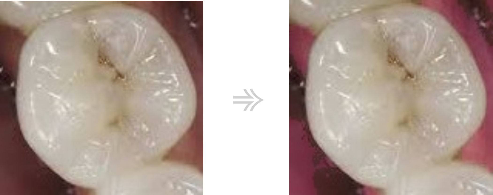

# Outline of program
Program, through a graphical user interface (GUI), enables users to input oral images.
 Upon loading the oral image, the program performs image preprocessing using the functions of enhancing (intensifying the color of the gums), blur (noise reduction for precise discrimination), and deleting gum (removing the gums). 
Subsequently, it utilizes an implemented machine learning model to determine whether the corresponding tooth has cavities or not. 
Through this process, users can easily assess oral health by loading oral images via the GUI and checking the results for the respective teeth.

# Process
## 1. Enhancing

intensifying the color of the gums

## 2. Blurring

intensifying the color of the gums

## 3. Deleting gum

intensifying the color of the gums

## 4. CNN
using opensource

# Output
## When tooth has cavities

## When tooth has not cavities

